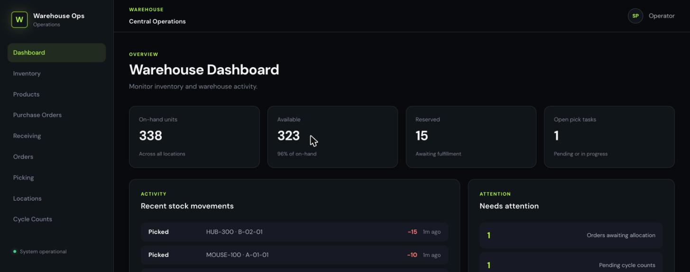
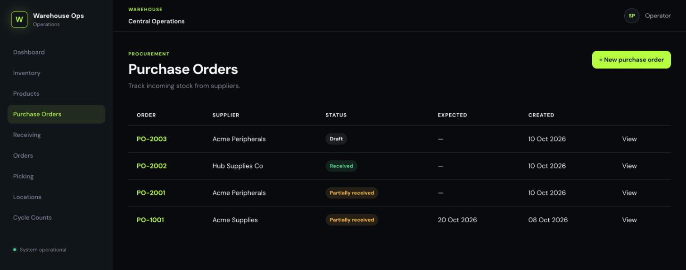
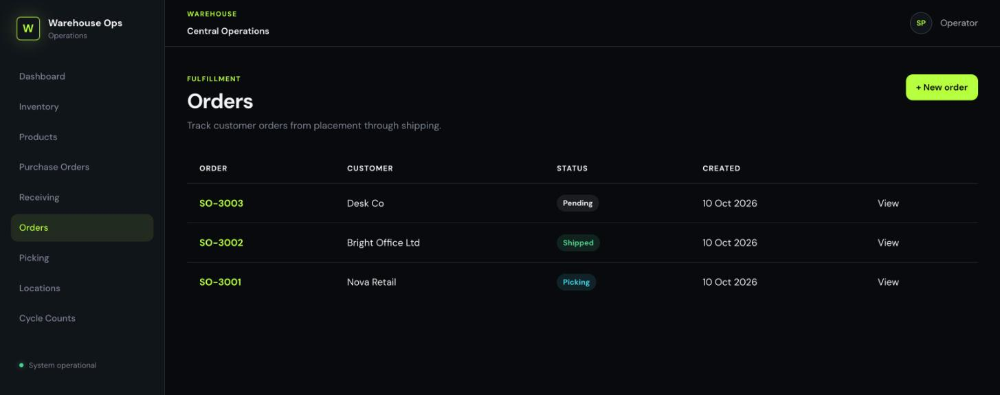
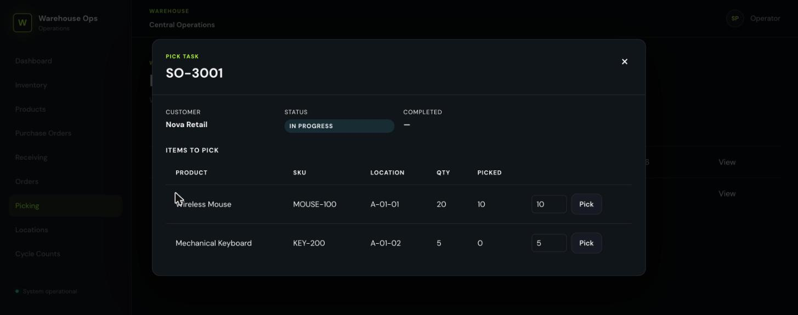
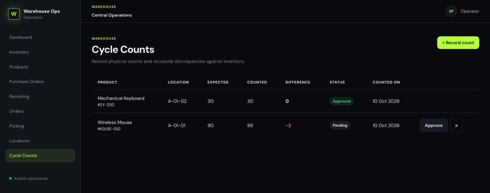

# Warehouse Ops

A warehouse management system covering the full flow of goods through a warehouse:

```
Purchase Order → Receiving → Storage → Inventory → Picking → Packing → Shipping
```

Also included: cycle counting, to reconcile physical counts against recorded inventory.

See [`docs/domain-model.md`](docs/domain-model.md) for the full domain model and invariants.

## Screenshots

**Dashboard** — live on-hand/available/reserved totals, open pick tasks, recent stock movements, and what needs attention.



**Purchase Orders** — track incoming stock from suppliers through draft, ordered, and (partially) received.



**Orders** — customer orders moving through allocation, picking, packing, and shipping.



**Picking** — work an open pick task location by location, with quantities validated against what's allocated.



**Cycle Counts** — record a physical count, see the discrepancy, approve it to post an inventory adjustment (or reject it).



## Tech stack

- **API** (`apps/api`) — Fastify, Drizzle ORM, PostgreSQL, Zod, TypeScript, Vitest
- **Web** (`apps/web`) — React, Vite, React Router, TypeScript
- Modular monolith: each domain (products, warehouses, inventory, purchase-orders, sales-orders, picking, cycle-counts) is a self-contained module with its own schema, repository, service, and routes

## Getting started

### Prerequisites

- Node.js 20+
- A local PostgreSQL instance, with two databases: one for development, one for running integration tests

### Install

```bash
npm install
```

### Configure

Create `apps/api/.env`:

```
DATABASE_URL=postgresql://<user>@localhost:5432/warehouse_ops
```

### Run migrations

```bash
npm run db:migrate -w apps/api
```

### Start the dev servers

```bash
npm run dev:api   # Fastify API on http://localhost:3001
npm run dev:web   # Vite dev server on http://localhost:5173
```

## Testing

```bash
npm run test -w apps/api               # unit tests
npm run test:integration -w apps/api   # integration tests (needs a *_test database; see apps/api/scripts/run-integration-tests.mjs)
npm run lint -w apps/web
```
